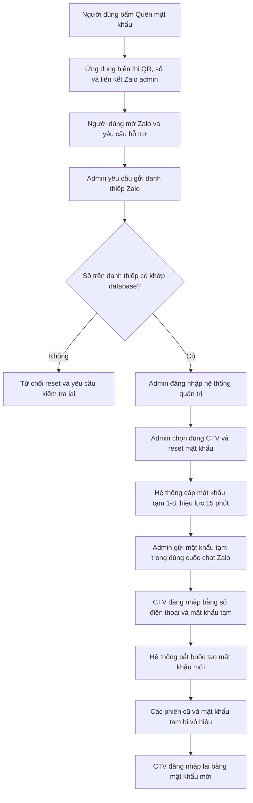

# Cập nhật và luồng quên/đổi mật khẩu

## 1. Mục tiêu cập nhật

Bổ sung khả năng xử lý quên mật khẩu cho hệ thống quy mô nhỏ mà không sử dụng OTP,
SMS hay Zalo OA. Việc xác minh được thực hiện thủ công qua Zalo cá nhân của admin.

Giải pháp này chỉ áp dụng cho tài khoản CTV. Super Admin không được đặt lại mật khẩu
của chính mình bằng chức năng quản trị này.

## 2. Những phần đã cập nhật

### Giao diện người dùng

- Thêm nút **Quên mật khẩu?** tại trang đăng nhập.
- Thêm cửa sổ hướng dẫn liên hệ admin qua Zalo.
- Hiển thị mã QR, liên kết `https://zalo.me/0971716939` và số điện thoại dự phòng
  `0971716939`.
- Thay khu vực bên phải cửa sổ hỗ trợ bằng ảnh đội ngũ do chủ dự án cung cấp.
- Thêm màn hình bắt buộc đổi mật khẩu sau khi đăng nhập bằng mật khẩu tạm.
- Thêm mục đổi mật khẩu cho tài khoản đang đăng nhập.
- Thêm thao tác để Super Admin đặt lại mật khẩu cho CTV trong danh sách tài khoản.
- Giao diện có bố cục thích ứng cho máy tính và thiết bị di động.

### Backend và dữ liệu

- Thêm API cung cấp thông tin liên hệ Zalo cho frontend.
- Thêm API đổi mật khẩu cho tài khoản đang đăng nhập.
- Thêm API riêng để Super Admin reset mật khẩu của CTV.
- Thêm trạng thái bắt buộc đổi mật khẩu và thời hạn của mật khẩu tạm.
- Mỗi lần reset hoặc đổi mật khẩu sẽ vô hiệu hóa các phiên đăng nhập cũ.
- Ghi log thao tác reset: admin xử lý, tài khoản được xử lý và thời điểm thực hiện.
- Bổ sung migration `0004_add_password_recovery.sql`.
- Bổ sung các bài kiểm thử tự động cho luồng quên và đổi mật khẩu.

## 3. Luồng nghiệp vụ đã chốt

### Diễn giải từng bước

1. Người dùng bấm **Quên mật khẩu?** trên trang đăng nhập.
2. Hệ thống hiển thị mã QR, liên kết và số Zalo cá nhân của admin.
3. Người dùng nhắn yêu cầu quên/đổi mật khẩu cho admin.
4. Admin yêu cầu người dùng **gửi danh thiếp Zalo**; không xác minh bằng số do người
   dùng tự gõ trong tin nhắn.
5. Admin lấy số điện thoại từ danh thiếp và đối chiếu với database.
6. Nếu khớp, admin đăng nhập bằng tài khoản Super Admin, tìm đúng CTV và xác nhận reset.
7. Hệ thống đặt mật khẩu tạm cố định là `1-8`, có hiệu lực trong 15 phút.
8. Admin gửi mật khẩu tạm cho người dùng ngay trong cuộc trò chuyện đã xác minh.
9. Người dùng đăng nhập bằng số điện thoại đã đăng ký và mật khẩu `1-8`.
10. Hệ thống chỉ cho phép người dùng đi đến màn hình đổi mật khẩu; các chức năng khác
    tạm thời bị khóa.
11. Người dùng nhập `1-8`, đặt mật khẩu mới ít nhất 8 ký tự và xác nhận lại.
12. Sau khi đổi thành công, mật khẩu tạm và các phiên cũ mất hiệu lực. Người dùng đăng
    nhập lại bằng mật khẩu mới.

## 4. Quy tắc và phân quyền

- Chỉ Super Admin mới được reset mật khẩu cho CTV.
- CTV không thể reset mật khẩu cho bản thân hoặc tài khoản khác từ trang quản trị.
- Không cho phép dùng chức năng này để reset tài khoản Super Admin.
- Mật khẩu tạm là `1-8`, dùng trong tối đa 15 phút và phải được thay ngay sau khi đăng nhập.
- Sau khi đổi thành công, `1-8` không còn hiệu lực đối với tài khoản đó.
- Nếu reset lần nữa, phiên đăng nhập và mật khẩu được cấp ở lần trước bị vô hiệu.
- Mật khẩu mới phải có ít nhất 8 ký tự và ô xác nhận phải trùng khớp.
- Người đang ở trạng thái bắt buộc đổi mật khẩu chỉ được đổi mật khẩu hoặc đăng xuất.

## 5. Cơ sở chấp nhận về bảo mật

Số điện thoại dùng để đối chiếu phải lấy từ danh thiếp Zalo được chia sẻ trong cuộc
trò chuyện, không lấy từ nội dung người dùng tự nhập. Cách này tận dụng gián tiếp bước
xác minh số điện thoại của tài khoản Zalo và phù hợp với quy mô vận hành nhỏ hiện tại.

Đây không phải là giải pháp xác thực mạnh tương đương OTP do hệ thống tự phát hành.
Các rủi ro đã biết và được chấp nhận ở giai đoạn này gồm:

- SIM đã đổi chủ nhưng dữ liệu hệ thống chưa cập nhật.
- Tài khoản Zalo của người dùng bị chiếm quyền.
- Quy trình phụ thuộc vào một admin cá nhân.
- Mật khẩu tạm cố định có thể bị lộ nếu quy trình xác minh không được tuân thủ.

## 6. Yêu cầu vận hành

- Admin phải yêu cầu danh thiếp Zalo và đối chiếu đúng số trong database trước khi reset.
- Chỉ gửi mật khẩu tạm trong chính cuộc trò chuyện đã được xác minh.
- Không gửi mật khẩu tạm vào nhóm hoặc qua người trung gian.
- Kiểm tra đúng họ tên và số điện thoại của CTV trước khi bấm xác nhận.
- Khi liên kết Zalo không hoạt động, hướng dẫn người dùng liên hệ số `0971716939` được
  hiển thị trên màn hình.
- Tra cứu log khi có tranh chấp hoặc yêu cầu kiểm tra ai đã reset tài khoản.

## 7. Phạm vi chưa thực hiện

- Chưa tích hợp OTP qua SMS, email hoặc ứng dụng xác thực.
- Chưa tích hợp Zalo OA hay gửi tin nhắn Zalo tự động.
- Chưa tự động xác minh quyền sở hữu số điện thoại.
- Chưa có quy trình nhiều admin cùng phê duyệt.
- Chưa thay thế mật khẩu tạm cố định bằng mã ngẫu nhiên dùng một lần.

Các phần này có thể được xem xét khi số lượng người dùng hoặc yêu cầu bảo mật tăng lên.

